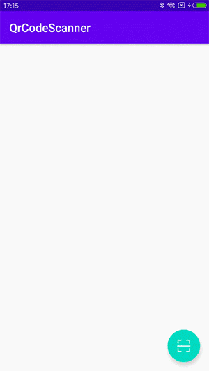

# QrCodeScanner

[](https://android-arsenal.com/api?level=21) [](https://jitpack.io/#giswangsj/QrCodeScanner)

非常简单易用的android二维码扫描库，不需要你申请权限，简单到一行代码搞定。当别人还在焦头烂额地写着代码，你已经在喝咖啡了。


**Preview**




Implementation
----


```xml
allprojects {
    repositories {
        maven { url 'https://jitpack.io' }
    }
}

dependencies {
	implementation 'com.github.giswangsj:QrCodeScanner:v1.0.0'
}
```

Usage
----

In your activity or fragment

```xml
QrCodeScanner.with(this)
    .onSuccess {
    	tvResult.text = "扫描结果：$it"
    }
    .onFail {
    	tvResult.text ="扫描失败：$it"
    }
    .start()
```

## License

```
MIT License

Copyright (c) 2020 wangsj

Permission is hereby granted, free of charge, to any person obtaining a copy
of this software and associated documentation files (the "Software"), to deal
in the Software without restriction, including without limitation the rights
to use, copy, modify, merge, publish, distribute, sublicense, and/or sell
copies of the Software, and to permit persons to whom the Software is
furnished to do so, subject to the following conditions:

The above copyright notice and this permission notice shall be included in all
copies or substantial portions of the Software.

THE SOFTWARE IS PROVIDED "AS IS", WITHOUT WARRANTY OF ANY KIND, EXPRESS OR
IMPLIED, INCLUDING BUT NOT LIMITED TO THE WARRANTIES OF MERCHANTABILITY,
FITNESS FOR A PARTICULAR PURPOSE AND NONINFRINGEMENT. IN NO EVENT SHALL THE
AUTHORS OR COPYRIGHT HOLDERS BE LIABLE FOR ANY CLAIM, DAMAGES OR OTHER
LIABILITY, WHETHER IN AN ACTION OF CONTRACT, TORT OR OTHERWISE, ARISING FROM,
OUT OF OR IN CONNECTION WITH THE SOFTWARE OR THE USE OR OTHER DEALINGS IN THE
SOFTWARE.
```

